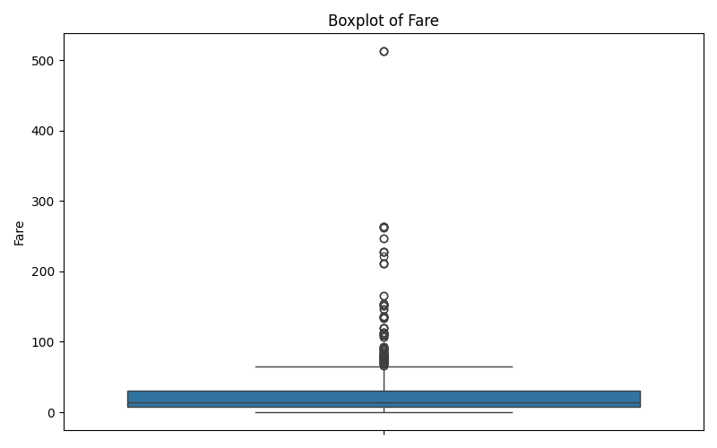

# 🚢 Titanic Data Exploration - EDA with Graphs

A beginner-friendly Exploratory Data Analysis (EDA) project using the **Titanic Dataset**. This project uses **Python** libraries like `pandas`, `matplotlib`, and `seaborn` to uncover patterns, analyze missing values, and generate meaningful visualizations.

---

## 📂 Repository Name

**titanic-eda-insights**

---

## 📁 Dataset

File used: `Titanic-Dataset.csv`  
Ensure the dataset is placed in the same folder as the Python script.

---

## 📊 Visualizations Included

### 🔹 1. Age Distribution


### 🔹 2. Fare Distribution


### 🔹 3. Boxplot of Age


### 🔹 4. Boxplot of Fare


### 🔹 5. Correlation Heatmap


### 🔹 6. Pairplot of Selected Features


---

## 🛠️ Technologies Used

- Python 🐍  
- Pandas  
- Matplotlib  
- Seaborn  

---

## 👤 Author

**Puchalapallieeswaridevi**

---

## 🤝 Contribution

```markdown
📌 Feel free to ⭐ star, 🍴 fork, and contribute to this repository!
```
